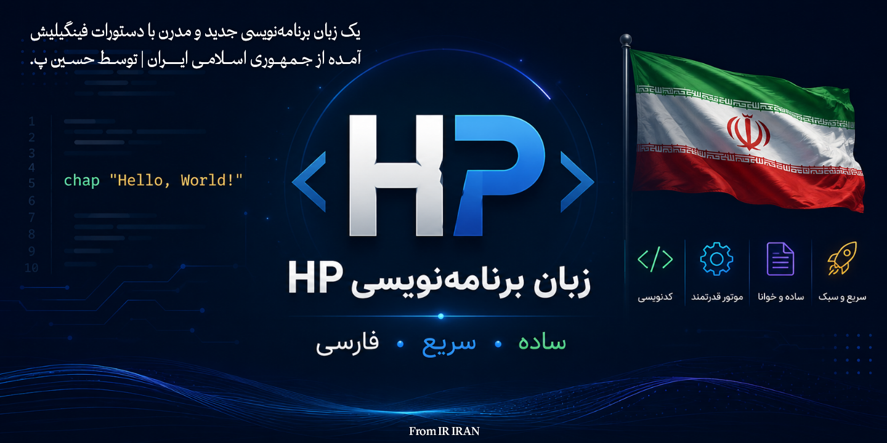

[](README-FA.md)

### 📌 Docs: [](https://deepwiki.com/HP2000C/HP-Programming-Language) 
<p align="center">


</p>


# ✅ HP™ Programming Language
### 🧑🏻‍💻 HP™ Programming Language | A programming language with Iranian origin that has a simple syntax (grammatical structure) based on “Finglish” (Persian written with Latin letters); this language was developed by Hossein P. 😎🙂🇮🇷✊🏻
#### ‼️ HP™ 2026 - 1405 ©

## 🔍 Simple Code Example
```hp
set name = "Hossein P."
chap "Hello " + name
```

## 📌 About
A modern and practical programming language, originating from the Islamic Republic of Iran 🇮🇷✊🏻, developed by Hossein P. 😎 for use by all Persian speakers and the great nation of Iran, and even all people of the world, in 2026...

With its simple and Finglish syntax design, this language has managed to become one of the simplest programming languages in the world for Persian speakers, so that we can all easily use this attractive and practical programming language!

> ✊🏻 It is hoped that one day this programming language will be used by people all over the world...
>
> > **— 😎 Hossein P.** | Developer of the HP Programming Language

## 📥 Execution
To run and use this programming language, you must first view or download the `requirements.txt` file, and then install the library/libraries listed inside it in your Python code execution environment. Then download the Python file `HP.py` or Copy its contents, and save it in an environment designed for running Python code.

In the next step, according to the syntax, write a program and save it with your desired name and the `.hp` extension in the same folder as the main file (`HP.py`), then go to the main file and run it.

Now you should enter the name of the file you saved along with its extension, so that your file will run and you can easily use this programming language...!

‼️You can also use any of the BETA version files, (such as C (Cython), JavaScript, and Ruby), but the developer assumes no responsibility whatsoever, including if the BETA versions do not work, etc., and please tell us if there is a problem... (through `Gmail Support.md` or Issues or...)

# 📖 HP Programming Language Reference Guide

**Finglish syntax, concise rules, and practical examples**

HP is a small interpreted language with Finglish keywords such as `Chap`, `Set`, `Agar`, `Vagarna`, `Loop`, `Baraye`, `Tabe`, and `Bargard`. This guide focuses on user-facing syntax and keeps terminology consistent throughout the text.

The language engine automatically detects simple data types: string, integer, float, boolean, null, percentage, array, dictionary, and date.

## Keyword Table

| HP Keyword | Meaning |
|---|---|
| Chap | print / output |
| Set | definition or assignment |
| Agar / Vagarna | if / else |
| Loop | conditional loop |
| Baraye | for loop |
| Az / Ta / Gam / Dar | from / to / step / in |
| Tabe | function |
| Bargard | return |
| Emtehan / Khata / Hamishe | try / error / always |
| EzafeBe / HazfAz | add / remove |
| Begir | input |
| Dorost / Ghalat / Hich | true / false / nothing |
| Baghimande | remainder |
| ... | comment |

> Note: Identifiers can be written in Finglish. It is better to keep reserved words in the same HP form.

## ۱. Variables and Values

Use `Set` to create a variable. If the variable already exists, it can be assigned a new value again with `=`.

Strings can be written with double or single quotation marks. Numbers, booleans, null, and percentages are also supported.

```hp
Set name = "Amin"
Set age = 14
Set price = 19.99
Set active = Dorost
Set missing = Hich
Set discount = 15%

name = "Reza"
```

```hp
Chap name
Chap age
Chap discount
```

## ۲. Arrays and Dictionaries

Arrays are written with square brackets. Index numbering starts from 1.

Dictionaries are written with `;` between pairs and `:` between the key and value.

```hp
Set nums = [10, 20, 30, 40]

Chap nums.get(1)
Chap nums.length()
Chap nums.sum()
Chap nums.avg()
```

```hp
nums.add(50)
nums.remove(2)

Chap nums
```

```hp
Set user = ["name":"Ali";"age":25]

Chap user.value("name")
Chap user.key(25)
Chap user.has("age")
Chap user.keys()
Chap user.values()
Chap user.length()
```

## ۳. Dates

HP supports Jalali and Gregorian dates.

For a Jalali date use `@YYYY/MM/DD`, and for a Gregorian date use `@@YYYY/MM/DD`.

The special value `@today` returns the current date.

```hp
Set today = @today
Set d1 = @1402/10/15
Set d2 = @@2024/01/05

Chap d1.year()
Chap d1.month()
Chap d1.day()
Chap d1 - d2
```

## ۴. Conditions and Loops

Conditional blocks are written with `Agar` and `Vagarna`.

`Loop` is a condition-based loop.

`Baraye` can work with ranges, arrays, dictionaries, and strings.

```hp
Agar score >= 90 {
    Chap "A"
} Vagarna {
    Agar score >= 80 {
        Chap "B"
    } Vagarna {
        Chap "F"
    }
}
```

```hp
Set i = 1
Loop i <= 5 {
    Chap i
    Set i = i + 1
}
```

```hp
Baraye n Az 1 Ta 10 Gam 2 {
    Chap n
}

Baraye item Dar [10, 20, 30] {
    Chap item
}
```

## ۵. Functions

Functions begin with `Tabe` and are closed with `}f`.

Parameters can have default values.

`Bargard` exits the function and can also return a value.

```hp
Tabe add(a, b) f{
    Bargard a + b
}f
```

```hp
Tabe greet(name, prefix = "Hello") f{
    Bargard prefix + ", " + name
}f
```

```hp
Tabe factorial(n) f{
    Agar n <= 1 {
        Bargard 1
    } Vagarna {
        Bargard n * factorial(n - 1)
    }
}f
```

## ۶. Error Handling and Mathematics

Use `Emtehan`, `Khata`, and `Hamishe` for error handling and cleanup.

The expression engine supports mathematical calculation, comparison, factorial, absolute value, power, remainder, and several auxiliary mathematical functions.

Current built-in functions include `sqrt`, `int`, `float`, `str`, `bool`, and `abs`.

```hp
Emtehan {
    Set result = 10 / 0
} Khata {
    Chap "An error occurred"
} Hamishe {
    Chap "Cleanup"
}
```

```hp
Chap $Sin(90)
Chap $Cos(45)
Chap $Tan(30)
Chap $Log(100)
Chap $GCD(24, 36)
Chap $LCM(4, 6)
Chap 5!
Chap | -10 |
Chap 2 ^ 8
Chap 10 mod 3
```

```hp
Chap sqrt(16)
Chap int(3.9)
Chap float(42)
Chap str(100)
Chap bool(1)
Chap abs(-5)
```

## ۷. Output, Input, Comments, and Flow Control

`Chap` prints a value to the terminal.

`Begir` reads user input and can also have a prompt.

A single-line comment in the current engine is written with `...`.

```hp
Chap "Hello"
Chap red("Warning")
Chap green("Done")

Set name = Begir("Enter your name: ")
Chap "Hello " + name
```

```hp
... This is a comment! This line is ignored
Chap "Visible output" ... This part is ignored too
```

```hp
break
continue
return
return 42
```

## ۸. Expression Rules

Whenever execution order matters, use parentheses.

Comparison operators include `==`, `!=`, `<`, `>`, `<=`, and `>=`.

Strings are concatenated with `+`, and multiplying a string by a number is also supported.

```hp
Set result = (3 + 4) * 2
Chap 5 == 5
Chap 10 > 7
Chap 8 <= 8
Chap 3 != 4
```

```hp
Chap "HP " + "language"
Chap 10 + 5
Chap 20 - 3
Chap 6 * 7
Chap 15 / 3
```

## Summary

HP was built for Finglish syntax, with a focus on simplicity, readability, and direct execution.

The main rules that should be remembered are:

- HP keywords
- Assignment with `Set`
- Printing with `Chap`
- Condition with `Agar`
- Function with `Tabe`
- Return with `Bargard`
- Loop with `Loop` and `Baraye`

With these rules, short, readable, and extensible programs can be written...

## 🖼 Logo:


